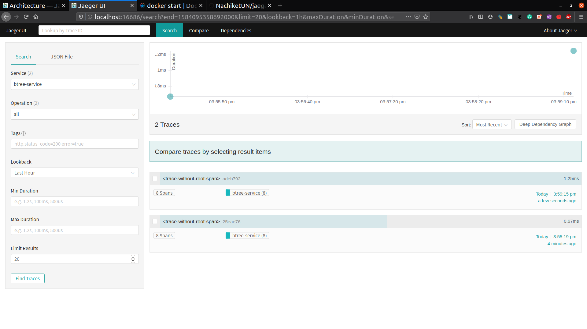
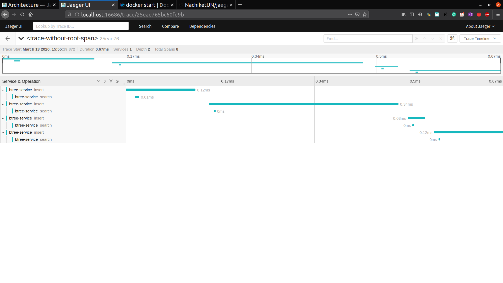

# jaegar-tracing-cpp
Instrumentation of select few CPP Programs using Jaegar CPP Client and Jaegar Tracing UI

## Prerequisites
Start the pre-built all-in-one jaeger docker image which contains the Jaeger UI, collector, query, and agent, with an in memory storage component. (https://www.jaegertracing.io/docs/1.17/getting-started/)

```bash
  docker run -d --name jaeger \
  -e COLLECTOR_ZIPKIN_HTTP_PORT=9411 \
  -p 5775:5775/udp \
  -p 6831:6831/udp \
  -p 6832:6832/udp \
  -p 5778:5778 \
  -p 16686:16686 \
  -p 14268:14268 \
  -p 14250:14250 \
  -p 9411:9411 \
  jaegertracing/all-in-one:1.17
```
The jaeger UI is available at https://localhost:16686


## Building

To build:

```bash
    mkdir build
    cd build
    cmake ..
    make
```
## B*Tree
This program contains two main functions "insert" and "search", both have their own corresponding spans.
After building, the [Btree](./examples/App.cpp) program can be run
with:

```bash
    ./app ../examples/config.yml
```


